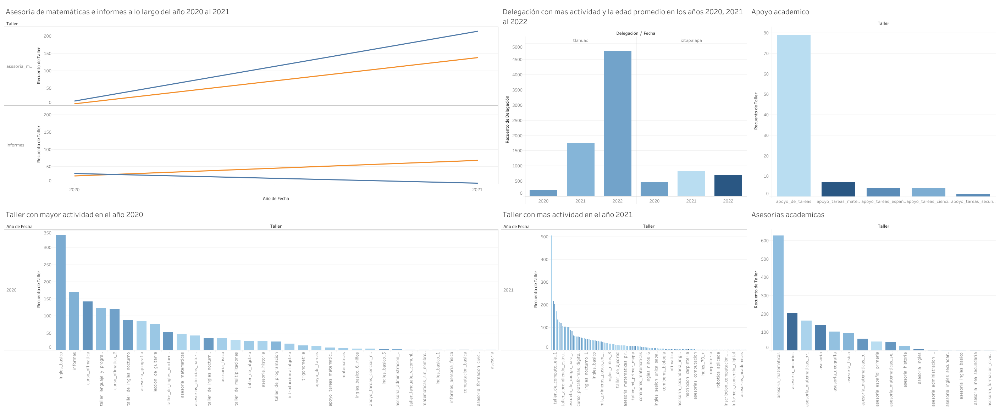
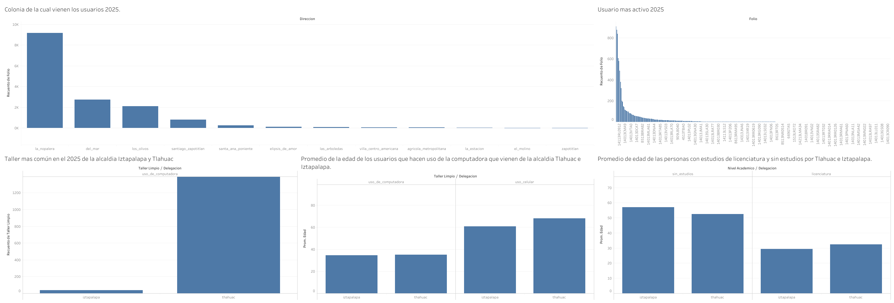

# 🚔 Análisis de talleres, edades y resago educativo en PILARES, TLAHUAC, CDMX | Data Analyze

## 📌 Objetivo del proyecto

Analizar datos de Pilares Nopalera de los años 2020, 2021, 2022 y 2025 para observar el resago educativo, talleres mas demandados y las edad promedio de los usuarios. Esto para implementar acciones pedagogicas y "motivar" a las personas a continuar con sus estudios de educación basica, media superior y superior. 

---

## 🛠️ Tecnologías utilizadas

  

- Python
- Power BI
- Excel 
- Pandas

---

## 🧱 Arquitectura del proyecto

  

---

## 🎥 Videos del proyecto

<table>
<tr>

<td align="center">

## 🎥 Explicación en Español

### 🇺🇸 English Version

</td>

</tr>
</table>

---

## 📊 Dashboard y visualizaciones

### Dashboard en Power BI

  
</a>

  
</a>

---

## ⚙️ Flujo de trabajo del pipeline

1. Extracción de datos históricos sobre los usarios en el Pilares Nopalera de los años 2020, 2021, 2022 y 2025. 
2. Limpieza, validación y transformación de datos utilizando Python y Pandas.
3. El proceso ETL nos genera un archivo CSV limpio de mis datos. 
4. Visualización y análisis de los datos con Tableau.
---

## 📈 Resultados obtenidos

- En promedio las personas jovenes entre la edad 15 a 14 años venian por cursos de computación y talleres de matemáticas. 
- Adultos mayores entre 60 y 55 años no tenian ningun tipo de educacion, mientras que las personas adultas entre 29 y 30 años tenian estudios superiores. 
- Habían personas que venian de la delegación Iztapalapa, ahí es donde se concentraba un poco mas que en Tlahuac el rezago educativo. 
- Construcción de un pipeline ETL con ayuda de Python. 

---

## 🧠 Qué aprendí

- Arquitectura basica para analizar datos. 
- Procesos ETL utilizando Python.
- Manejo de Tableau para organizar la información. 
- Diseño de dashboards para la toma de decisiones. 

---

## 🚀 Futuras mejoras

- Incorporar los datos de los años 2026 para contrastar con los anteriores. 
- Contrastar con otras alcaldias. 
- Crear modelos predictivos sobre comportamiento de los talleres de matemáticas. 
- Escalar el proyecto, pero esto requiere acudir a otros PILARES para tener acceso a esa información. 

---
